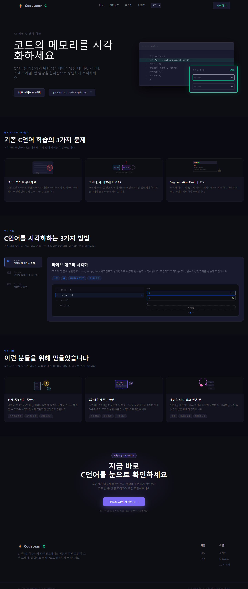
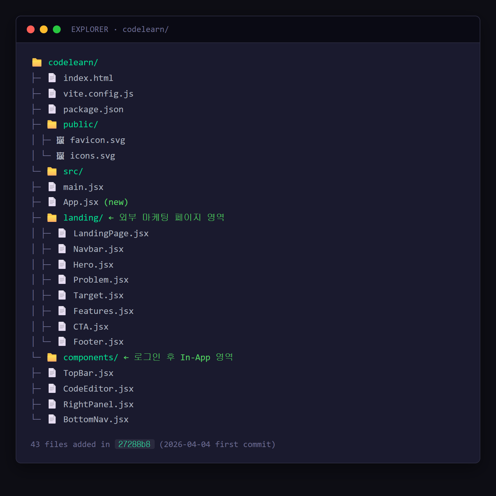
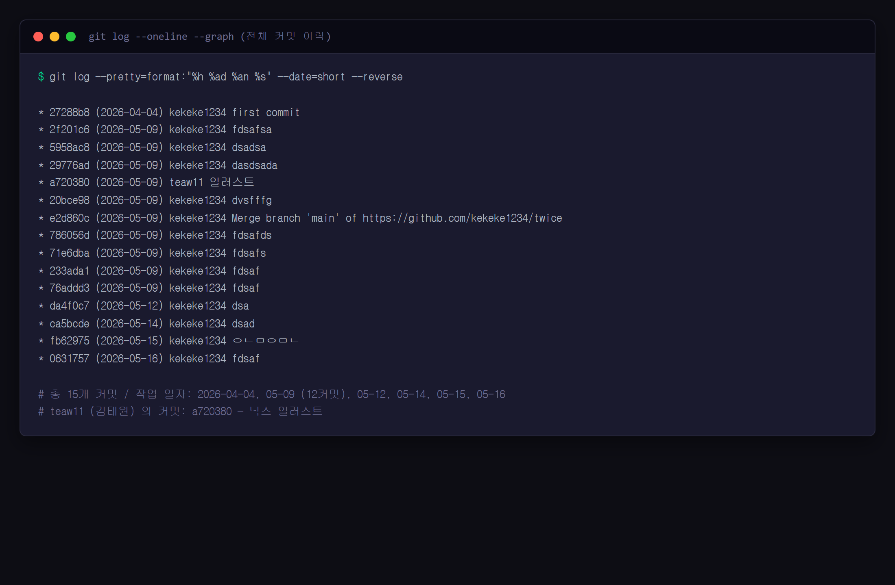

# 연구일지 — 2026-04-04 (1일차)

## 개요

| 항목 | 내용 |
|---|---|
| 작성자 | 장재영 (3학년) |
| 팀원 | 장재영(팀장, 풀스택 개발 · Git: `kekeke1234`), 김태원(디자인·일러스트 · Git: `teaw11`) |
| 프로젝트명 | **twice / codelearn** — 입문자용 C언어 학습·채점 웹 플랫폼 |
| 사용 기술 | React 19, Vite 8, JavaScript(ESM), CSS Modules |
| 오늘의 커밋 | `27288b8` first commit (43개 파일, +5,566 라인) |
| 작업 시간 | 단일 커밋 (저녁 시간대, 12:17 push) |

## 1. 오늘의 목표

- **영재원에서 받은 주제** ("C언어 학습 플랫폼") 위에서, **타겟 사용자(C 처음 배우는 중학생) + 두 가지 차별화 축**(① 메모리·변수 시각화 ② 친절한 한국어 오류 메시지) 을 정하고, 그에 맞는 **초기 골격(Skeleton)** 을 잡는다.
- 랜딩 페이지(Landing) + 코드 에디터 화면(In-App) 두 가지 거시 구조를 동시에 세팅한다.

## 2. 오늘 한 일 (Git 기반)

커밋 `27288b8` 한 건으로 43개 파일이 한 번에 생성되었다. 폴더 구조와 의도는 다음과 같다.

```
codelearn/
├── index.html, vite.config.js, package.json   ← Vite + React 19 베이스
├── public/favicon.svg, icons.svg              ← 아이콘 스프라이트
└── src/
    ├── main.jsx, App.jsx, App.css
    ├── landing/                ← 비로그인 외부용 페이지
    │   ├── LandingPage.jsx
    │   ├── Navbar.jsx (+css)
    │   ├── Hero.jsx (+css)        ← +363 lines CSS
    │   ├── Problem.jsx (+css)
    │   ├── Target.jsx (+css)
    │   ├── Features.jsx (+css)    ← +353 lines CSS
    │   ├── CTA.jsx (+css)
    │   └── Footer.jsx (+css)
    └── components/             ← 로그인 후 에디터 화면
        ├── TopBar.jsx (+css)
        ├── CodeEditor.jsx (+css)
        ├── RightPanel.jsx (+css)
        └── BottomNav.jsx (+css)
```

추가 자산: `ASDF.png`, `two.png`, `src/assets/hero.png` — 디자인 시안 캡쳐와 히어로 이미지.

## 3. 왜 이렇게 기획했는가 (본인 회고)

> **주제 선정** 
> "**주제는 영재원에서 정해주었다.** '정보 영재성 신장을 위한 산출물' 로 어떤 걸 만들지 고민하다가, **C언어 학습 플랫폼** 이라는 주제를 받았다. 받은 주제 위에서 '어떤 학습 플랫폼이어야 하는가' 는 내가 정해야 했다."

> **누구를 위한 것인가 — 타겟 유저** 
> "**C를 처음 배우는 중학생**, 즉 나와 비슷한 나이대를 대상으로 잡았다. 내가 직접 C를 배우면서 느낀 어려움이 가장 정확한 사용자 인터뷰 자료라고 생각했다. 같은 나이대 학습자가 막히는 지점을 내가 가장 잘 안다."

> **기존 서비스(백준·프로그래머스)와 무엇을 다르게 할 것인가 — 차별화** 
> "두 가지를 차별점으로 잡았다. 
> ① **메모리와 변수의 시각화** — 코드를 짜다 보면 '지금 변수 안에 뭐가 들어 있는지, 메모리가 어떻게 잡혀 있는지' 가 안 보여서 입문자가 길을 잃는다. 그걸 그림으로 보여주고 싶다. 
> ② **친절한 오류 메시지** — 영문 컴파일 오류는 입문자에게 외계어다. 한국어로 풀어줘야 학습이 끊기지 않는다. 
> 이 두 가지가 **나중에 5/12 의 문제 데이터 확장, 5/16 의 Judge0 한국어 변환** 같은 결정의 기준이 된다."

> **왜 팀원 김태원에게 일러스트/디자인 역할을 분리해서 맡겼나** 
> "**개발을 둘이 같이 하면 같은 파일을 동시에 만지다가 충돌이 너무 많이 난다.** 그래서 일을 분리해서, 김태원이 일러스트와 시각 자산을 담당하고 내가 개발을 맡았다. 역할이 깔끔하게 갈라져서 git 충돌을 피할 수 있고, 김태원의 그림 실력이 잘 발휘되는 영역에 집중할 수 있다."

## 4. 영재성 기준별 자기 분석

### 🧠 논리·사고력 (Logical Thinking)
- 주제는 영재원에서 주어졌지만, **타겟 사용자(C를 처음 배우는 중학생)** 와 **두 가지 차별화 축(메모리·변수 시각화 + 한국어 친화 오류 메시지)** 은 본인이 직접 결정. "넓은 학습 플랫폼" 이 아니라 **두 개의 핵심 가치 명제** 로 좁힌 사고 과정 자체가 논리적 정의 단계.
- 폴더 구조를 `landing/` ↔ `components/` 로 이원화한 것은 시각 분리가 아니라 **"로그인 전/후" 라는 상태 축** 기반. 같은 화면이라도 사용자 맥락이 다르면 코드 위치를 분리하는 관심사 분리 원칙.

### 🧩 문제해결력 (Problem Solving)
- "C를 처음 배우는 학습자가 어디서 막히는가" 라는 문제 정의를 **자기 자신의 학습 경험** 에서 추출 → 메모리 시각화·오류 메시지라는 두 해결 단위로 변환. 추상적 문제를 **구현 가능한 기능** 단위까지 분해한 사고.
- 6개월 분량의 산출물 전체를 한 번에 만들 수 없음을 인지하고, 첫 날엔 **자리만 비워둔 골격** 으로 시작. 점진적 구현 전략.

### 💡 창의성 (Creativity)
- **메모리/변수 시각화** 라는 차별점은 일반 코딩 사이트(백준·프로그래머스 등)가 안 하는 영역. "코드는 보여주지만 메모리는 안 보여준다" 는 기존 도구의 사각지대를 발견해 차별점으로 잡음.
- **친절한 오류 메시지 한국어화** 도 단순 번역이 아닌 "입문자가 이해할 수 있는 표현으로 의역" 이라는 방향성. 두 차별점이 나중에 5/12, 5/16 의 핵심 작업으로 그대로 이어짐.

### 🤝 협업·리더십 (Collaboration)
- **"같은 파일 동시 수정 → Git 충돌" 이라는 협업의 현실 리스크** 를 첫 날에 식별 → 개발(장재영) ↔ 일러스트·디자인(김태원) 으로 역할을 **완전히 분리**. 협업 갈등을 사후 해결하는 게 아니라 **구조적으로 사전 방지**.
- 김태원이 그림에 강하다는 강점을 살리는 영역으로 배치 — 단순 분담이 아니라 **개인 역량 매칭**.

## 5. 막힌 점 & 내일 할 일

- 막힌 점: **인앱 화면에서 코드 실행을 어떻게 처리할 것인가** (브라우저 단독 실행 불가 → 외부 채점 서버 필요). 오늘은 자리만 비워두고 결정 보류.
- 내일 할 일: 디자인 시스템 문서(`DESIGN.md`)를 작성해 색/타이포 토큰을 고정 → 김태원이 일러스트 색 톤을 맞추기 쉽게 한다.

## 6. 스크린샷

> ⚠️ **사용자 첨부 필요** 
> 아래 위치에 직접 캡쳐 이미지를 저장하면 자동으로 일지에 표시됩니다.

| 캡쳐 항목 | 저장 위치 | 권장 내용 |
|---|---|---|
| 첫 커밋 후 빈 랜딩 페이지 | `research-journal/screenshots/2026-04-04_01_landing-skeleton.png` | `npm run dev` 후 `/` 접속 화면 |
| 폴더 구조 트리 | `research-journal/screenshots/2026-04-04_02_folder-tree.png` | VS Code 좌측 탐색기 확장 캡쳐 |
| 첫 커밋 Git 그래프 | `research-journal/screenshots/2026-04-04_03_git-graph.png` | GitHub의 첫 커밋 `27288b8` 페이지 |







---
*Git 출처: commit `27288b8` (2026-04-04 12:17 KST, by kekeke1234)*
