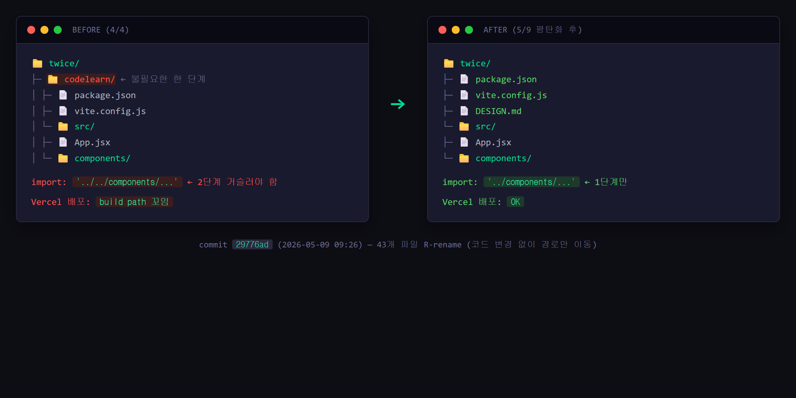
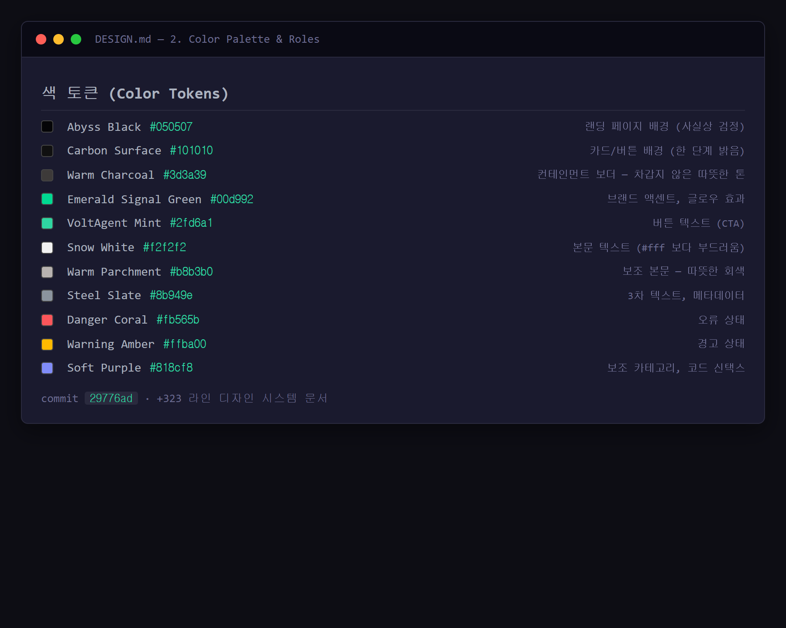
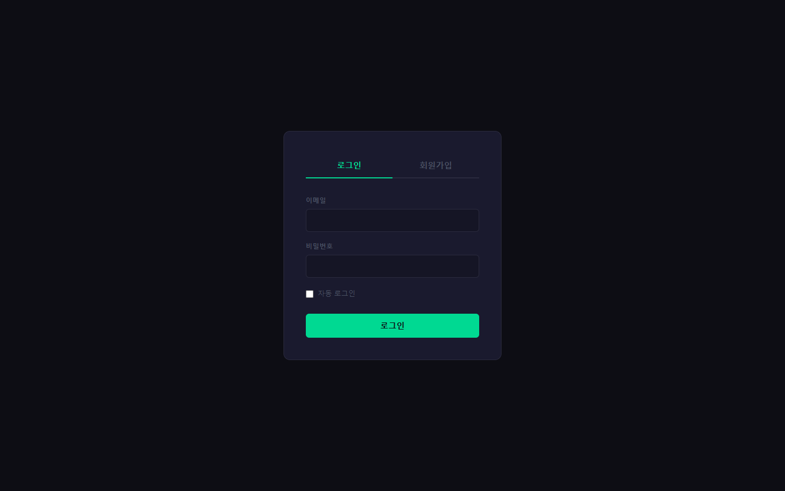
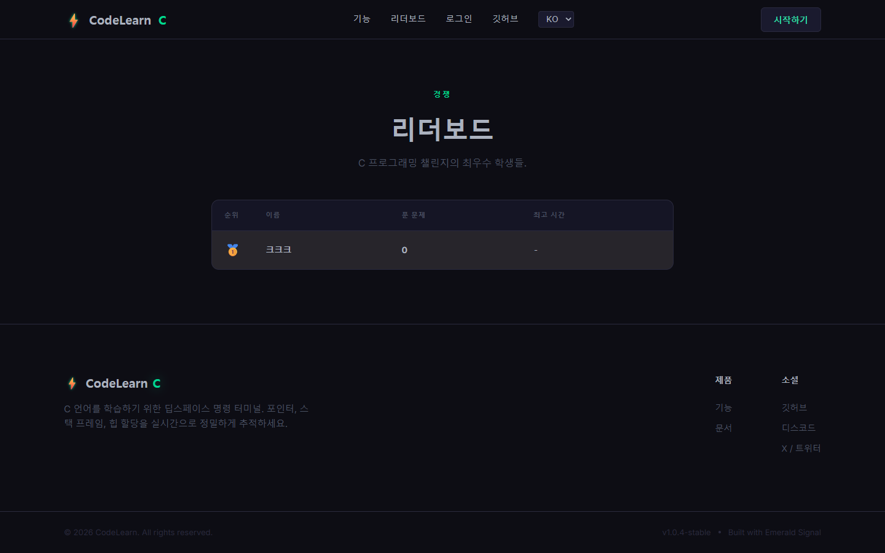

# 연구일지 — 2026-05-09 (2일차)

## 개요

| 항목 | 내용 |
|---|---|
| 작성자 | 장재영 (3학년) |
| 팀원 | 장재영(팀장 · Git: `kekeke1234`), 김태원(디자인·일러스트 · Git: `teaw11`) |
| 프로젝트명 | twice / codelearn |
| 오늘의 커밋 | 12건 — `2f201c6`, `5958ac8`, `29776ad`, `a720380` (teaw11), `20bce98`, `e2d860c` (merge), `786056d`, `71e6dba`, `233ada1`, `76addd3`, …(`fdsafsa` 등 임시 메시지 포함) |
| 작업 시간 | 09:06 ~ 12:46 (약 3시간 40분, 점심 전후 집중 작업) |
| 영향 파일 | 약 60개 (랜딩 전면 재작업 + AuthContext / AuthPage / LeaderboardPage 신설 + cValidator 1차 + DESIGN.md 작성) |

## 1. 오늘의 목표

1일차에 만든 "임시 골격" 을 본격 학습 플랫폼 형태로 끌어올린다. 구체적으로:
1. **폴더 구조 평탄화** — `codelearn/src/*` 가 한 단계 깊어 import 경로가 길다. 루트 직속으로 끌어올린다.
2. **디자인 시스템 확정** — 김태원이 일러스트 색 톤을 맞출 수 있도록 `DESIGN.md` 토큰 표를 먼저 박는다.
3. **인증·리더보드 페이지 신설** — 학습 플랫폼의 동기 부여(랭킹)와 진입(로그인) 흐름 마련.
4. **cValidator(클라이언트 사이드 C 문법 검증)** 1차 — 외부 서버 없이도 "이거 컴파일 안 됩니다" 정도는 즉시 알려주는 fallback.
5. **김태원 일러스트 합류** — 마스코트 "닉스(Nyx)" 첫 자산 머지.

## 2. 오늘 한 일 (Git 기반)

### 2-1. 폴더 평탄화 (`29776ad`)
- `codelearn/src/**` 의 모든 파일을 루트 `src/**` 로 이동 (43개 파일 R-rename).
- `codelearn/README.md` → `README.md`, `codelearn/package.json` → `package.json` 등 설정 파일도 함께 끌어올림.
- 결과: import 경로가 `../../components/...` 에서 `../components/...` 로 한 단계씩 짧아져 가독성 ↑.

### 2-2. 디자인 시스템 확정 (`29776ad` 내 `DESIGN.md` +323 라인)
- 색 토큰: `Abyss Black #050507`, `Carbon Surface #101010`, `Emerald Signal Green #00d992`, `Warm Charcoal #3d3a39` 등 9개 정식 명명.
- 타이포: system-ui(헤딩) + Inter(본문) + SFMono(코드) 3단 시스템.
- 11단계 그림자/엘리베이션 표 + Do/Don't 규칙 20여 개.

### 2-3. 인증·리더보드 (`786056d`)
- `src/context/AuthContext.jsx` (+63) — 로그인 상태 전역 관리.
- `src/pages/AuthPage.jsx` (+68) / `AuthPage.css` (+117) — 로그인·회원가입 통합 화면.
- `src/pages/LeaderboardPage.jsx` (+71) / `LeaderboardPage.css` (+150) — 사용자 점수 랭킹.

### 2-4. cValidator 1차 (`71e6dba`, `76addd3`)
- `src/cValidator.js` 총 +366 / -383 (대규모 1차 작성 + 즉시 리팩토링).
- `main` 함수 존재 여부 검사, 토큰 분리, 한글 친화적 오류 메시지(`error: empty input file`, `gcc: fatal error: no main function defined` 등).

### 2-5. 다국어 컨텍스트 1차 (`233ada1`, `76addd3`)
- `src/context/LanguageContext.jsx` 신설(+50→이후 확장).
- `Navbar.jsx` 에 언어 토글 자리 마련.

### 2-6. 김태원 합류 (`a720380` by `teaw11`)
- `닉스-removebg-preview.png` — 마스코트 캐릭터 1차 일러스트 (배경 제거 처리 완료본).
- 머지 커밋 `e2d860c` 로 장재영(`kekeke1234`)이 main에 통합.

## 3. 왜 이렇게 기획했는가 (본인 회고)

> **왜 디자인 시스템(DESIGN.md)을 먼저 확정했나** 
> "**먼저 디자인을 정해놓고, 그 디자인을 쭉 유지하면서 조금씩 수정만 해나가기 위해서.** 색·폰트·간격을 일관되게 가져가지 않으면, 페이지가 추가될 때마다 톤이 들쭉날쭉해진다. 처음에 토큰 표를 한 번 박아두면 이후엔 '이 색을 쓸까 저 색을 쓸까' 고민할 필요가 없다. 김태원이 닉스 일러스트 색감을 맞출 때도 같은 기준을 쓸 수 있다."

> **왜 인증(로그인) + 리더보드(랭킹) 를 함께 넣었나** 
> "**학습자가 계속 풀게 만들려면 동기부여가 필요하다. 그게 랭킹.** 다른 사람보다 잘하고 싶다는 마음이 학습을 끌고 간다. 그래서 점수가 쌓이는 리더보드를 만들었고, 점수를 쌓으려면 로그인이 있어야 하니까 둘은 짝으로 들어갔다. **'게임 요소'** 가 1일차에 잡은 차별화 방향(중학생 입문자 대상)에도 부합한다."

> **왜 마스코트 '닉스(Nyx)' 를 도입했나** 
> "**게임을 좋아하는 학생들의 흥미를 유발** 하기 위해서. 코딩 사이트가 너무 도구처럼만 생기면 입문자 입장에서 차가워 보인다. 캐릭터가 한 명 있으면 사이트가 친근해지고, 나중에 오류가 났을 때 캐릭터가 '대신 말해주는' 안내자 역할도 할 수 있다. 게이밍 톤의 학습 환경을 만드는 게 1일차의 타겟(중학생) 과 잘 맞는다."

> **왜 폴더 구조를 평탄화했나 (`codelearn/*` → 루트로)** 
> "**배포를 한 번 해보려고 했는데, `codelearn/` 폴더가 한 단계 더 있으니까 빌드 경로가 많이 꼬였다.** Vercel 같은 배포 서비스가 루트의 `package.json` 을 보고 빌드하는데, 한 단계 안에 있으면 설정이 복잡해진다. 그래서 배포 시도 중에 막혀서 폴더를 끌어올렸다. 이건 머릿속으로 미리 계획한 게 아니라 **실제 배포 시도가 막혔던 경험** 에서 나온 결정."

## 4. 영재성 기준별 자기 분석

### 🧠 논리·사고력
- **"디자인을 먼저 정해놓고 유지·수정만 한다"** 는 작업 원칙. 즉흥적으로 화면을 만드는 게 아니라 **기준을 먼저 세우고 그 위에서 변형** 하는 절차적 사고.
- 인증과 리더보드를 따로 만들지 않고 **"동기부여 = 랭킹 + 로그인" 의 짝** 으로 묶어서 같은 날 처리. 두 기능이 서로의 전제 조건임을 인지하고 동시 도입.

### 🧩 문제해결력
- **실제 배포 시도 중에 폴더 경로가 꼬이는 문제** 를 만나고, 그 자리에서 **"폴더를 평탄화한다"** 는 근본 해결로 대응. 임시 우회가 아니라 구조 자체를 고친 결정.
- cValidator 1차를 같이 작성 — 외부 채점기 없이도 "main 함수가 없네요" 정도는 알려줄 수 있어야 한다는 부분 해결을 선제적으로 마련.

### 💡 창의성
- **"게임 요소를 학습 플랫폼에 넣는다"** 는 발상. 마스코트 닉스 + 리더보드 랭킹은 단순 기능이 아니라 **"중학생의 게임 친화성" 이라는 사용자 특성에 맞춘 학습 동기 설계**.
- 학습 사이트를 차가운 도구가 아니라 **친근한 게임형 환경** 으로 만들겠다는 톤 결정 자체가 기존 코딩 사이트와의 차별점.

### 🤝 협업·리더십
- 김태원의 닉스 일러스트(`a720380`) 가 들어올 자리를 사전 세팅 — `src/assets/` 폴더 + DESIGN.md 의 색 토큰. **팀원의 산출물이 충돌 없이 흡수되는 환경** 을 미리 만들어 둠.
- 1일차에 결정한 "역할 분리" 원칙(개발 ↔ 일러스트) 이 실제로 효과를 보이는 첫 날. 김태원의 첫 합류 커밋이 충돌 0건으로 머지됨.

## 5. 막힌 점 & 내일(다음 작업일) 할 일

- 막힌 점: 커밋 메시지가 임시 문자열(`fdsafsa`, `dsa`)로 남아 영재원 산출물용으로 그대로 제출하기 어려움.
  - 대응 검토: `git rebase -i` 로 squash + 메시지 정리 vs. 일지(이 문서) 에서 보강. → 학습 흔적을 지우는 게 오히려 부정확하므로 **그대로 두되 일지로 의미 부여**.
- 다음 작업일(5/12): 다국어 시스템을 본격 확장(50줄 → 400줄) + 다크/라이트 테마 컨텍스트 추가 + 문제 데이터(`problems.js`) 확충.

## 6. 스크린샷

> ⚠️ **사용자 첨부 필요**

| 캡쳐 항목 | 저장 위치 | 권장 내용 |
|---|---|---|
| 평탄화 전/후 폴더 트리 비교 | `research-journal/screenshots/2026-05-09_01_folder-flatten-before-after.png` | VS Code 좌측 탐색기에서 `codelearn/` 단계가 사라진 모습 |
| DESIGN.md 색 토큰 표 | `research-journal/screenshots/2026-05-09_02_design-tokens.png` | DESIGN.md 의 색 팔레트 섹션 캡쳐 (헥스 코드 보이게) |
| 로그인 화면 (AuthPage) | `research-journal/screenshots/2026-05-09_03_auth-page.png` | `npm run dev` → `/auth` 접속 화면 |
| 리더보드 화면 | `research-journal/screenshots/2026-05-09_04_leaderboard.png` | `/leaderboard` 접속, 더미 데이터 채워진 상태 |
| 닉스 마스코트 일러스트 | `research-journal/screenshots/2026-05-09_05_nyx-illustration.png` | `닉스-removebg-preview.png` 자체를 다른 이름으로 캡쳐 |

---
*Git 출처: commits `2f201c6` → `76addd3` (2026-05-09 09:06–12:46 KST). 팀원 김태원의 첫 합류 커밋: `a720380`.*
