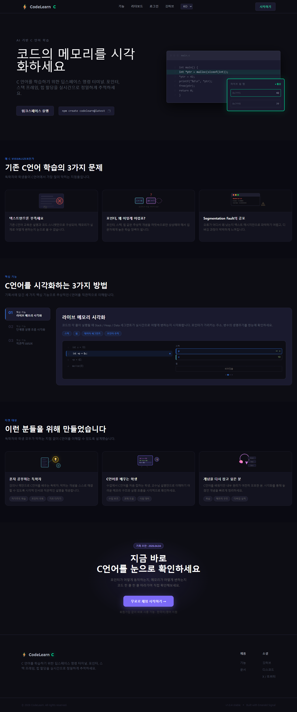
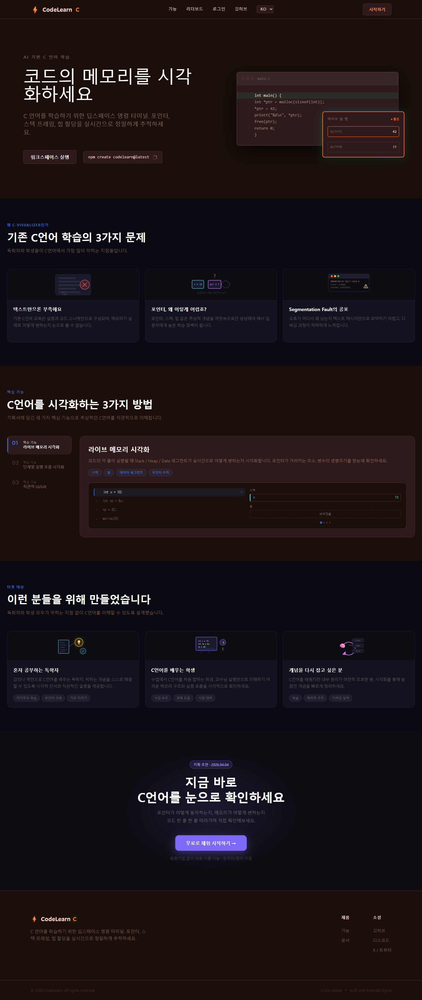
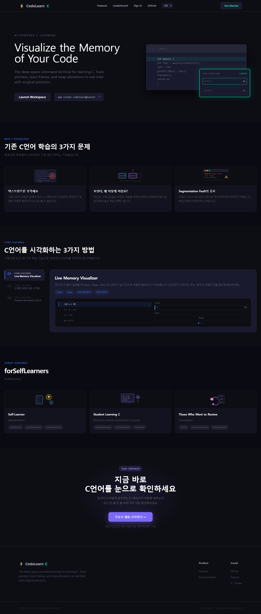
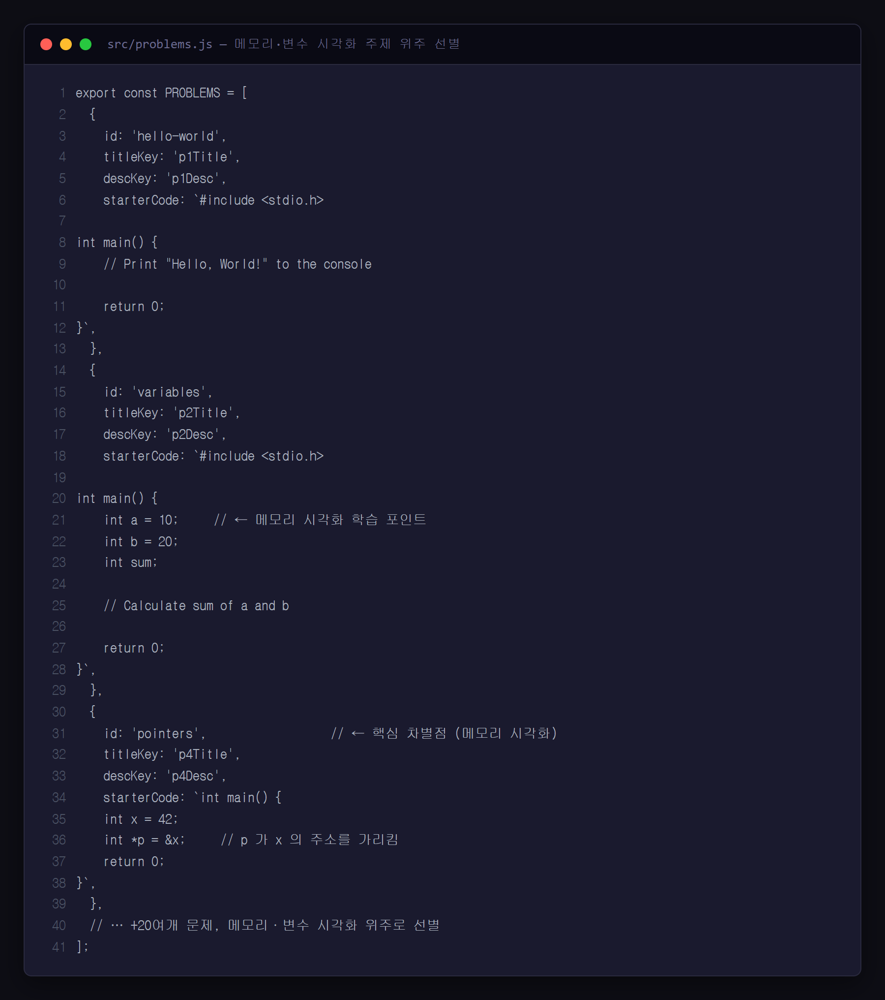

# 연구일지 — 2026-05-12 (3일차)

## 개요

| 항목 | 내용 |
|---|---|
| 작성자 | 장재영 (3학년) |
| 팀원 | 장재영(팀장 · Git: `kekeke1234`), 김태원(디자인·일러스트 · Git: `teaw11`) |
| 프로젝트명 | twice / codelearn |
| 오늘의 커밋 | 1건 — `da4f0c7` ("dsa") |
| 작업 시간 | 22:27 KST (저녁 늦은 단일 푸시, 변경 라인 +1,645 / -349) |
| 영향 파일 | 18개 — `TopBar.{jsx,css}`, `LanguageContext.jsx`(+368), `ThemeContext.jsx`(+164 신설), `problems.js`(+259), 랜딩 5개 컴포넌트, 페이지 3개 |

## 1. 오늘의 목표

- **다국어 시스템** 을 50줄짜리 placeholder에서 **실제 i18n 사전(dictionary)** 으로 확장.
- **다크/라이트 테마** 를 ThemeContext로 분리해 사용자가 선택 가능하게 만든다.
- **문제 데이터(`problems.js`)** 를 더미 1~2개에서 실제 학습용 문제 셋(+259 라인)으로 채운다.
- **TopBar** 를 단순 헤더에서 "언어 선택 + 테마 토글 + 문제 정보" 컨트롤러로 격상.

## 2. 오늘 한 일 (Git 기반)

### 2-1. LanguageContext 본격 확장 (+368 라인)
- 한국어/영어 두 언어의 번역 사전(dictionary) 키를 50개 이상 정의.
- 랜딩(Hero, Problem, Target, Features, CTA, Footer) 전 영역의 텍스트가 사전 키로 치환됨.
- Provider 패턴: `<LanguageProvider>` 안에서 `useLanguage()` 훅으로 `t('key')` 호출.

### 2-2. ThemeContext 신설 (+164 라인)
- `light` / `dark` 두 모드를 `data-theme` 속성으로 `<html>` 에 부착.
- `localStorage` 에 사용자 선택을 영구 저장 → 다음 방문 때도 유지.
- CSS 측에서 `[data-theme="light"]` 셀렉터로 색 토큰을 오버라이드.

### 2-3. TopBar 대규모 개선 (+174 JSX / +428 CSS)
- 좌: 닉스 로고 + 문제 번호/제목 (LanguageContext 사용해 자동 번역).
- 중: 시간(타이머) 영역.
- 우: 언어 토글(KR/EN) + 테마 토글(🌙/☀️) + 사용자 메뉴.

### 2-4. problems.js 확장 (+259 라인)
- 입문~초급 C언어 문제 다수 추가 — `Hello, World!` 출력부터 `for` 루프, 배열 합계 등.
- 각 문제에 `title`(한/영), `description`, `starterCode`, `testCases`, `difficulty` 필드.

## 3. 왜 이렇게 기획했는가 (본인 회고)

> **왜 다국어(한/영) 기능을 넣었나** 
> "**한국 프로그램인데 계속 영어로 나와서 불편했다.** 다른 외국 라이브러리·도구를 쓰다 보면 모든 게 영어라 학습자가 막힌다. 그래서 우리 사이트는 기본을 한국어로 잡았다. 그런데 한편으로는 **영어로 쓰고 싶은 사용자도 있을 수 있다** — 영어 공부도 같이 하고 싶거나, 외국인 친구에게 보여주고 싶거나. 그래서 토글로 둘 다 가능하게 만들었다."

> **왜 다크/라이트 테마 토글을 넣었나** 
> "**사용자가 테마를 직접 선택할 수 있게 해주기 위해서.** 기본은 다크 모드지만, 사람마다 눈에 편한 모드가 다르다. 밝은 화면이 편한 사용자도 있고, 새벽에 공부할 때 다크 모드가 편한 사용자도 있다. **선택권을 주는 게 사용자 존중**."

> **왜 문제 데이터(problems.js)를 크게 늘렸나 — 어떤 종류의 문제를 우선으로 넣었나** 
> "**다양한 문제를 풀게 하고 싶었고**, 특히 **우리 프로젝트의 주제가 '메모리와 변수의 시각화' 이니까 그 주제와 관련된 문제를 우선으로 넣었다.** 그냥 출력 문제만 모으는 게 아니라, '변수에 값을 대입하면 메모리에 어떻게 들어가는지', '포인터가 무엇을 가리키는지' 같은 **시각화가 효과를 발휘할 수 있는 문제** 들로 셋을 채우려고 했다. 1일차에 잡은 차별화 방향을 문제 데이터 단계에서 구체화한 것."

## 4. 영재성 기준별 자기 분석

### 🧠 논리·사고력
- 다국어가 필요한 이유를 **두 방향(① 한국어 우선 ② 영어도 선택 가능)** 으로 동시에 분석. "한국 서비스니까 한국어만" 이 아니라, **한국어를 기본으로 두면서 선택지를 열어두는 절충점**을 찾은 것이 논리적 균형 감각.
- 문제 데이터를 무작위로 늘리지 않고, **"메모리·변수 시각화" 라는 1일차 차별화 기준** 에 맞춰 선별. **상위 목표 → 하위 의사결정** 의 일관성.

### 🧩 문제해결력
- "외국 도구가 영어라 불편하다" 는 본인의 실제 사용자 경험을 **우리 사이트의 다국어 기능** 으로 직접 연결. 학습자의 통증점(pain point) 을 자신의 체험에서 추출.
- 테마 선택을 강제하지 않고 **사용자 자율** 에 맡긴 것 — 한 가지 답을 정해주는 게 아니라 **사용자 환경의 다양성** 을 인정하는 접근.

### 💡 창의성
- 차별화 축인 **"메모리·변수 시각화"** 를 단순 슬로건으로 두지 않고, **실제 문제 데이터의 선별 기준** 으로까지 끌고 내려옴. 추상적 가치가 데이터 수준의 결정에 반영되는 흐름.
- 다크/라이트 + 한/영 의 4가지 조합 화면 — 같은 콘텐츠가 사용자 선택에 따라 다르게 보이는 **다축 커스터마이즈** 환경 구축.

### 🤝 협업·리더십
- 김태원의 닉스 일러스트(5/9 합류) 가 TopBar 의 로고 자리에 안정적으로 들어갈 수 있게 영역을 미리 정리. 팀원 산출물을 **방치하지 않고 시스템에 통합**.
- 한국어 문구·영어 문구 양쪽을 사전(dictionary) 형태로 정리해 두어, 추후 김태원이 카피 한 줄만 바꾸고 싶을 때도 코드를 깊이 안 봐도 되도록 분리.

## 5. 막힌 점 & 다음 작업일 할 일

- 막힌 점: 단일 커밋(`da4f0c7`)에 너무 많은 변경(+1,645 / -349)이 한꺼번에 들어감. 다음 작업일부터는 **기능 단위 커밋 분리** 를 의식적으로 연습.
- 다음 작업일(5/14): 오늘 추가한 18개 파일 중 스타일/구조 일관성이 어긋난 곳들 전반을 한 사이클 **리팩토링** 으로 정리.

## 6. 스크린샷

> ⚠️ **사용자 첨부 필요**

| 캡쳐 항목 | 저장 위치 | 권장 내용 |
|---|---|---|
| 기본 테마 (Emerald Dark) 랜딩 | `research-journal/screenshots/2026-05-12_01_dark-mode.png` | 기본 다크 테마의 Hero 영역 |
| Sunset 프리셋 랜딩 | `research-journal/screenshots/2026-05-12_02_light-mode.png` | 테마 프리셋 변경 사례 (Sunset Orange) — 실제로는 라이트 모드가 아니라 따뜻한 톤의 다른 다크 프리셋 |
| 언어 토글 KR ↔ EN | `research-journal/screenshots/2026-05-12_03_lang-toggle.png` | 영어로 전환한 같은 랜딩 |
| problems.js 데이터 구조 | `research-journal/screenshots/2026-05-12_04_problems-data.png` | VS Code에서 `problems.js` 한 문제 entry 보이는 화면 (사용자 직접 캡쳐) |

> **자기 정정 메모**: 본 프로젝트는 5종 프리셋(Emerald Dark / Midnight Blue / Forest Green / Sunset Orange / Ocean Blue) 모두 다크 계열이라 **진짜 라이트 모드는 없다.** "사용자가 테마를 선택" 한다는 기획 의도는 유지되지만, 일지의 "라이트 모드" 라는 표현은 부정확. 두 번째 캡쳐는 **Sunset Orange 프리셋** 으로 "테마 다양성" 을 보여주는 사례로 봐주세요.

---
*Git 출처: commit `da4f0c7` (2026-05-12 22:27 KST, by kekeke1234)*
