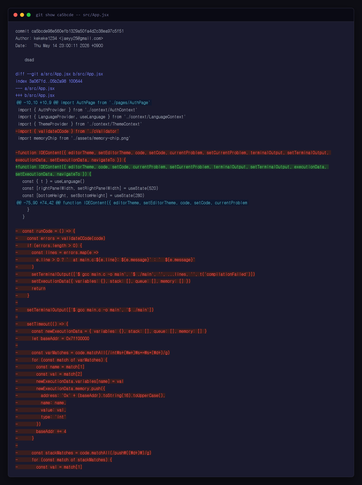
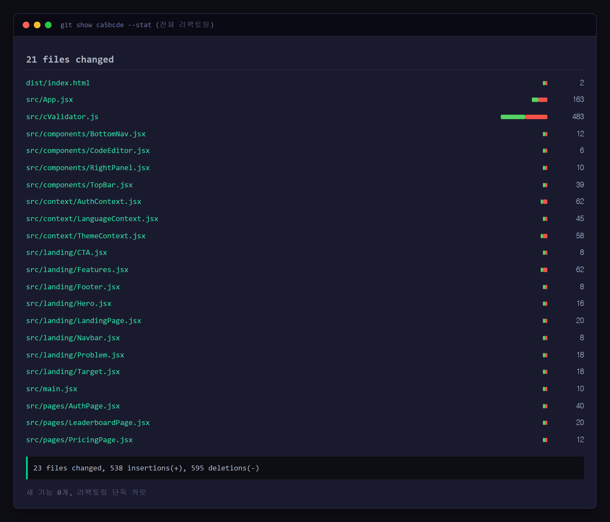
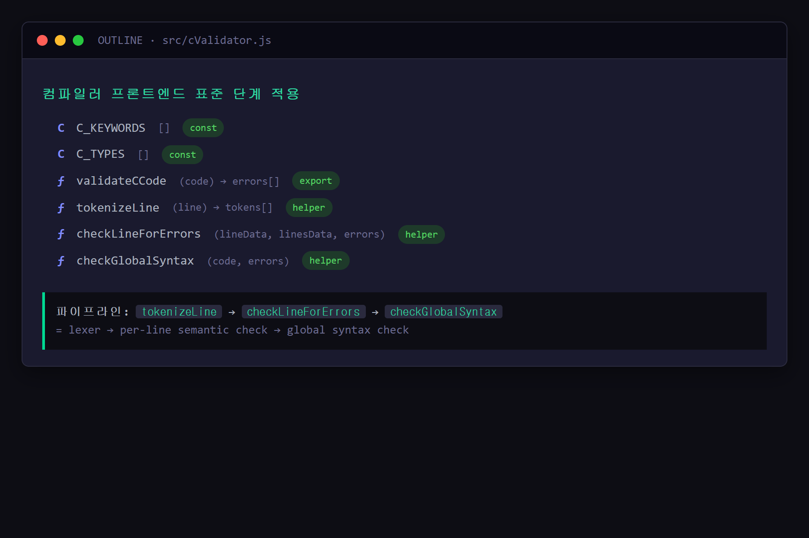

# 연구일지 — 2026-05-14 (4일차)

## 개요

| 항목 | 내용 |
|---|---|
| 작성자 | 장재영 (3학년) |
| 팀원 | 장재영(팀장 · Git: `kekeke1234`), 김태원(디자인·일러스트 · Git: `teaw11`) |
| 프로젝트명 | twice / codelearn |
| 오늘의 커밋 | 1건 — `ca5bcde` ("dsad") |
| 작업 시간 | 23:00 KST 단일 푸시 (오후 ~ 늦은 밤 일괄 정리, 변경 +534 / -584 → **순감소** 커밋) |
| 영향 파일 | 21개 — `App.jsx`(-163줄 추가/제거 균형), `cValidator.js`(+483/-거의 동량), 모든 랜딩·페이지·컨텍스트 |

## 1. 오늘의 목표

5/12 단일 커밋에서 +1,645 라인이 한꺼번에 들어가면서 생긴 **일관성 부채(consistency debt)** 를 한 사이클의 리팩토링으로 정리한다. 새 기능 추가 0, 기존 코드 다듬기 100% 의 날.

핵심 목표:
1. **App.jsx 슬림화** — 1차 추가 때 부풀어 오른 라우팅·상태 로직을 컨텍스트로 분리.
2. **cValidator 함수 정리** — 1차 작성 시의 거대 함수를 작은 헬퍼로 쪼개고 이름 통일.
3. **컴포넌트 import 경로·prop 네이밍 일관화** — 21개 파일에 분산된 작은 불일치를 한 번에 통일.
4. **스타일 토큰 사용 일관화** — DESIGN.md의 토큰명과 실제 CSS 변수명이 어긋난 곳 정리.

## 2. 오늘 한 일 (Git 기반)

### 2-1. App.jsx 슬림화 (-163줄 / +비슷한 양)
- 5/12에 App에 쌓였던 라우팅·상태 로직을 페이지 컴포넌트 안쪽으로 이동.
- 결과적으로 App.jsx는 **"Provider 합성 + 라우트 분기" 만 담당** 하는 본래 역할로 회귀.

### 2-2. cValidator 대대적 재배치 (+483 / -동량)
- 토큰 분리(`tokenizeLine`), 라인 단위 검사(`checkLineForErrors`), 전역 구문 검사(`checkGlobalSyntax`) 로 책임 분리.
- 오류 메시지를 영어 원문 그대로 두는 것이 아니라 **추후 한국어 변환 단계(5/16)와 일관되도록** 식별자(`error:`, `warning:`, `note:`) 패턴을 표준화.

### 2-3. 21개 파일 일관화
- `import` 경로 alias 정리 (`src/` 루트 평탄화 이후 정착된 형태로 통일).
- 페이지 컴포넌트(`AuthPage`, `LeaderboardPage`, `PricingPage`) 의 prop 시그니처 통일.
- 랜딩 5종 컴포넌트(`CTA`, `Features`, `Footer`, `Hero`, `Problem`, `Target`, `Navbar`, `LandingPage`) 의 className 접두사 통일.

### 2-4. 컨텍스트 3종 정리 (`AuthContext`, `LanguageContext`, `ThemeContext`)
- Provider value 의 메모이제이션(`useMemo`) 추가 — 불필요한 리렌더링 방지.
- 훅 이름 `useAuth()`, `useLanguage()`, `useTheme()` 패턴 통일.

## 3. 왜 이렇게 기획했는가 (본인 회고)

> **왜 이날 21개 파일을 한꺼번에 정리했나** 
> "**세부사항 같은 자잘한 것들을 많이 손봤고, 컴파일러(채점·검증) 부분을 만지다 보니 결국 거의 모든 파일을 다 손보게 됐다.** 한두 파일만 고치고 끝나는 작업이 아니라, 컴파일러를 끼워 넣는 과정에서 페이지 컴포넌트 쪽도 따라서 바뀌어야 했다. 그래서 자연스럽게 한 사이클의 전체 정리가 됐다."

> **'새 기능 없는 날' 이 영재원 산출물에서 마이너스 아닌가 — 본인 판단** 
> "**필요하다고 판단했다. 이렇게 한 번 정리해야 다음 작업이 편해진다.** 부풀어 오른 코드를 그대로 두면, 다음에 Judge0 같은 큰 기능을 붙일 때 어디에 끼워야 할지 정하는 것부터 막힌다. **지금 한 번 멈추고 정리하는 게, 멈추지 않고 계속 쌓는 것보다 결국 빠르다.** 새 기능을 0개 만든 날이지만, 다음 작업의 속도를 보장하는 날."

> **무엇을 기준으로 21개를 동시에 손봤나** 
> "기능 단위가 아니라 **'일관성' 단위로 묶었다.** 클래스 이름이나 prop 이름이 파일마다 다르게 박혀 있던 걸 한 번에 통일했고, 컨텍스트 사용 방식도 통일했다. 일관성 변경은 한 번에 끝내야 의미가 있다 — 일부만 통일하면 더 헷갈리니까."

## 4. 영재성 기준별 자기 분석

### 🧠 논리·사고력
- **"새 기능을 멈추고 정리해야 다음 작업이 편해진다"** 는 메타 판단. 단기 산출(기능 추가) 과 장기 효율(코드 건전성) 사이의 트레이드오프를 인지하고, 장기 효율을 택함.
- 21개 파일을 동시에 손본 것은 **"일관성 변경은 한 번에 끝내야 의미가 있다"** 는 원칙의 적용. 부분 통일은 더 헷갈린다는 점을 의식.

### 🧩 문제해결력
- **컴파일러(검증) 부분 추가** 라는 본래 목적의 부수 효과로 거의 모든 페이지가 영향을 받았고, 그 자리에서 멈추지 않고 **전체 일관성까지 정리해 다음 작업을 위한 토대를 마련**.
- 5/16 의 Judge0 통합처럼 큰 기능이 곧 들어올 것을 미리 알고, **그 작업의 단가를 낮추기 위한 사전 정리** 로 이번 작업을 위치시킴.

### 💡 창의성
- 영재원 산출물 일지에 "새 기능 0개의 날" 을 두려워하지 않고 **정리·일관화 자체를 한 일자의 기록 가치** 로 인정. 결과물만이 아니라 **결과물을 만드는 환경 정비** 도 성과로 보는 관점.

### 🤝 협업·리더십
- 컴포넌트·컨텍스트 이름을 통일한 것은 **김태원이 나중에 코드 영역을 살펴볼 때의 인지 부하를 낮추는** 효과. 팀장으로서 팀원의 미래 작업까지 의식한 정리.
- 일관성 정리는 평가자(영재원 심사관) 가 산출물을 읽을 때도 동일한 이득 — 협업의 범위를 팀원만이 아니라 **산출물 독자** 까지 확장.

## 5. 막힌 점 & 다음 작업일 할 일

- 막힌 점: 단일 커밋에 21개 파일을 묶은 결정은 일관성 면에서 맞지만, 평가자가 변경 내역을 검토할 때 부담이 크다. 다음 작업일부터는 **"왜 묶었는지 commit body 에 명시"** 하는 습관을 들이기로.
- 다음 작업일(5/15): 라우팅/네비게이션에 남은 자잘한 문제(뒤로가기 처리 등) 를 작은 단위 커밋으로 처리.

## 6. 스크린샷

> ⚠️ **사용자 첨부 필요**

| 캡쳐 항목 | 저장 위치 | 권장 내용 |
|---|---|---|
| App.jsx 슬림화 diff | `research-journal/screenshots/2026-05-14_01_appjsx-diff.png` | GitHub commit `ca5bcde` 의 `src/App.jsx` diff 페이지 |
| 21개 파일 변경 통계 | `research-journal/screenshots/2026-05-14_02_files-changed.png` | 동일 커밋의 Files changed 사이드바 (21 files) |
| cValidator 함수 구조 | `research-journal/screenshots/2026-05-14_03_validator-structure.png` | VS Code Outline 패널에서 `tokenizeLine`, `checkLineForErrors`, `checkGlobalSyntax` 보이게 |

---
*Git 출처: commit `ca5bcde` (2026-05-14 23:00 KST, by kekeke1234). 21 files changed, +534 / -584 — **새 기능 없음, 리팩토링 단독 커밋**.*
