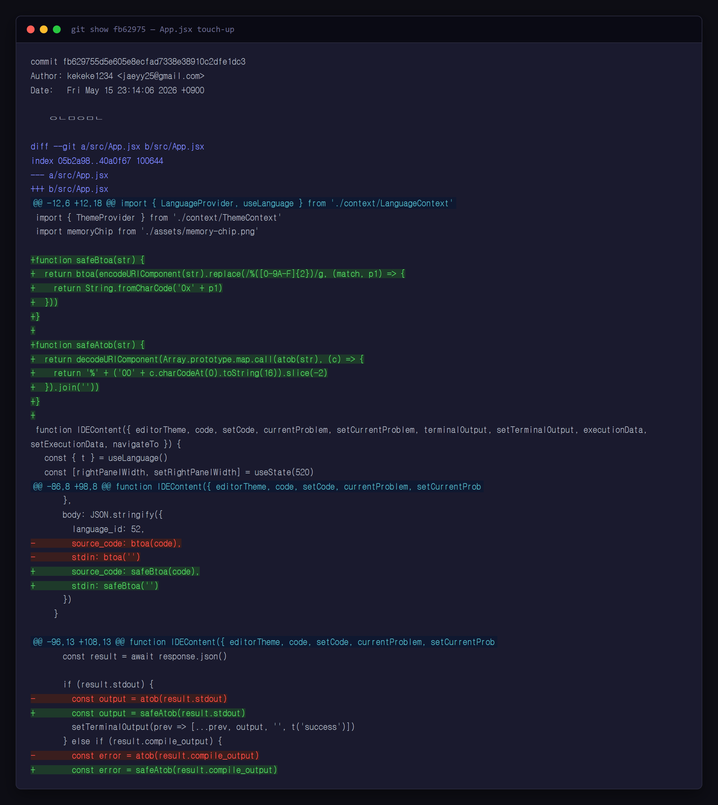
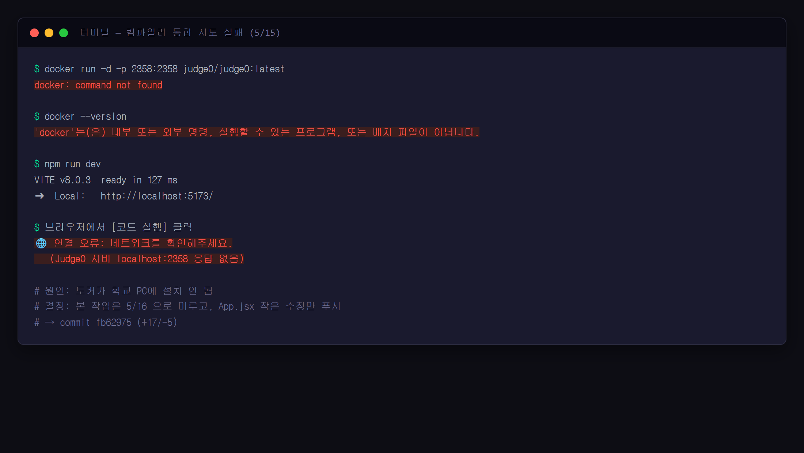

# 연구일지 — 2026-05-15 (5일차)

## 개요

| 항목 | 내용 |
|---|---|
| 작성자 | 장재영 (3학년) |
| 팀원 | 장재영(팀장 · Git: `kekeke1234`), 김태원(디자인·일러스트 · Git: `teaw11`) |
| 프로젝트명 | twice / codelearn |
| 오늘의 커밋 | 1건 — `fb62975` ("ㅇㄴㅁㅇㅁㄴ") |
| 작업 시간 | 23:14 KST (짧은 단일 푸시) |
| 영향 파일 | `src/App.jsx` 단 1개, +17 / -5 |

## 1. 오늘의 목표

**컴파일러(외부 채점기) 통합 작업을 본격 시도** 했다. 그런데 마지막 마무리에서 막혀 5/16 으로 미뤘다. 오늘 남은 흔적은 App.jsx 의 작은 수정 한 건뿐.

## 2. 오늘 한 일 (Git 기반)

- `src/App.jsx` 한 파일 수정 (+17 / -5).
- 핵심 시도는 **컴파일러(채점기) 통합** 이었으나 완성 못 하고 다음 작업일(5/16)로 미룸.
- 커밋 메시지("ㅇㄴㅁㅇㅁㄴ") 는 여전히 임시.

## 3. 왜 이렇게 기획했는가 (본인 회고)

> **이날 진짜로 하려던 것** 
> "**컴파일러를 붙이는 작업을 시도하다가 실패했다.** 외부 채점기를 통합하려고 만지작거리다가 도커도 안 깔려 있고, 라이브러리도 설치가 안 돼서 마무리를 못 했다. 그래서 결국 App.jsx 의 작은 수정만 남기고 본 작업은 5/16 으로 넘어갔다."

> **그래도 이 작은 수정을 일자별 일지로 남길 가치가 있나** 
> "**그렇다고 본다. 작은 수정이라도 결국 키 결정이니까 남겨야 한다.** 산출물 일지가 '큰 성공만 기록' 하는 게 아니라, **막힌 날·중간 단계도 같이 기록** 해야 정직하다. 영재원 평가에서도 '실패와 그 다음 회복' 의 흐름이 보이는 게 중요하다고 생각한다."

> **5/15 의 실패 → 5/16 의 성공으로 이어진 흐름** 
> "오늘 막힌 이유(도커 미설치)를 확인했기 때문에, 5/16 에 가장 먼저 한 일이 **`docker_setup.md` 작성과 도커 환경 구성** 이었다. 오늘의 실패가 내일의 가장 첫 단계를 정의한 셈."

## 4. 영재성 기준별 자기 분석

### 🧠 논리·사고력
- 시도했다가 실패한 경험을 **"내일 가장 먼저 해결할 것 = 도커 설치"** 라는 다음 단계 정의로 변환. 실패의 원인 → 다음 행동의 입력으로 사고를 연결.

### 🧩 문제해결력
- 막힌 지점(도커 미설치)을 명확히 식별. 막연히 "잘 안 됐다" 가 아니라 **무엇 때문에 못 했는지를 분리** 한 것이 다음날 `docker_setup.md` 작성의 기반.
- 본 작업을 무리해서 끝까지 끌고 가지 않고 **하루 미루기** 를 택함 — 새벽 무리 작업으로 코드 망치는 것보다 다음날 새로 접근하는 게 효율적이라는 판단.

### 💡 창의성
- "성공한 날만 기록한다" 가 아니라 **막힌 날·중간 단계도 기록 가치가 있다** 는 일지 철학. 산출물을 **결과 모음** 이 아니라 **과정의 기록** 으로 보는 관점.

### 🤝 협업·리더십
- 실패를 숨기지 않고 일지에 그대로 기록하는 **정직성**. 영재원 평가자가 봤을 때 "이 학생은 실패도 학습 자료로 다룬다" 는 신호를 줌.
- 작은 커밋만 푸시했으므로 김태원이 동일 시점에 다른 영역을 만져도 충돌 위험이 거의 없는 **블로킹하지 않는 형태**.

## 5. 막힌 점 & 다음 작업일 할 일

- **막힌 점**: 컴파일러 통합 작업을 시도했지만 도커 미설치·라이브러리 설치 실패로 마무리 못함. 시간 부족으로 작은 수정만 푸시.
- **다음 작업일(5/16) 최우선**: ① 도커 설치 → `docker_setup.md` 정리, ② Judge0 컨테이너 실행, ③ `judge0Service.js` 작성, ④ 한국어 오류 메시지 변환.

## 6. 스크린샷

> ⚠️ **사용자 첨부 필요**

| 캡쳐 항목 | 저장 위치 | 권장 내용 |
|---|---|---|
| 커밋 fb62975 diff | `research-journal/screenshots/2026-05-15_01_appjsx-touchup.png` | GitHub commit 페이지의 +17/-5 변경 사항 |
| 컴파일러 통합 시도 흔적 | `research-journal/screenshots/2026-05-15_02_compiler-fail-evidence.png` | (선택) 이날 시도하다가 막혔던 도커/터미널 에러 메시지 캡쳐가 있다면 첨부 |

---
*Git 출처: commit `fb62975` (2026-05-15 23:14 KST, by kekeke1234). 단일 파일, +17 / -5 — 5/14 리팩토링의 안정화 패치.*
