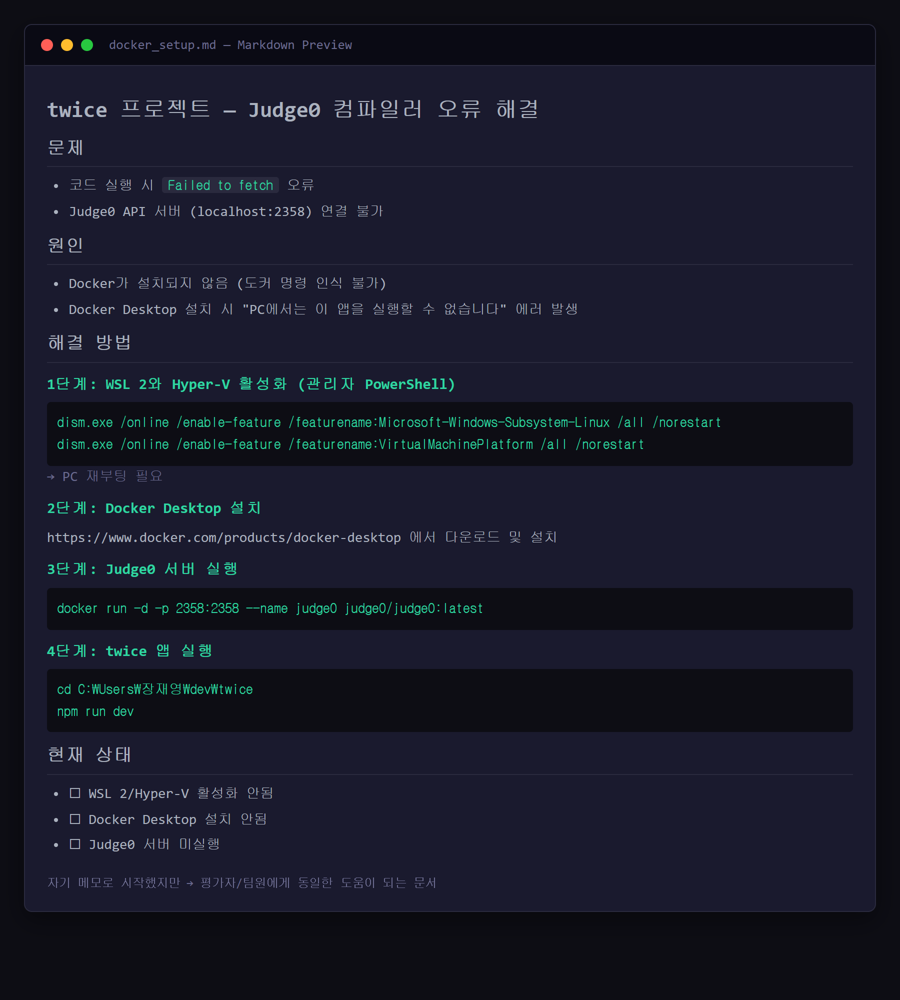

# 연구일지 — 2026-05-16 (6일차, 현재 시점)

## 개요

| 항목 | 내용 |
|---|---|
| 작성자 | 장재영 (3학년) |
| 팀원 | 장재영(팀장 · Git: `kekeke1234`), 김태원(디자인·일러스트 · Git: `teaw11`) |
| 프로젝트명 | twice / codelearn |
| 오늘의 커밋 | 1건 — `0631757` ("fdsaf") |
| 작업 시간 | 02:30 KST (새벽 집중 작업) |
| 영향 파일 | 12개, **+928 / -51** — 단일 일자 기준 두 번째로 큰 변화량. **신규 추가 파일 5개**(`judge0Service.js`, `docker-compose.judge0.yml`, `judge0.conf`, `docker_setup.md`, `image.png`). |

## 1. 오늘의 목표

**1일차에 잡은 두 차별점 중 두 번째 = "친절한 오류 메시지" 의 실제 구현일.** 또한 5/15 에 시도했다가 도커 미설치로 막혔던 외부 채점기 통합을 마무리한다. 구체적으로:

1. 어제(5/15) 막혔던 **도커 환경 구성** 부터 다시 시작 → 가이드(`docker_setup.md`) 정리.
2. **Judge0** 오픈소스 채점 엔진을 도커 컨테이너로 띄움.
3. 브라우저에서 직접 호출 가능한 `judge0Service.js` API 클라이언트 작성.
4. 영문 컴파일 오류를 **입문자가 이해할 수 있는 한국어 메시지로 자동 변환** — 자체 만든 `cValidator` 가 한계에 부딪힌 부분을 외부 도구로 보완.

## 2. 오늘 한 일 (Git 기반)

### 2-1. Judge0 API 클라이언트 (`src/services/judge0Service.js` +128 신설)
- `submitCode(sourceCode, languageId, stdin)` — base64 인코딩된 소스를 Judge0 `/submissions?wait=true` 로 POST.
- `getSubmission(token)` — 비동기 결과 조회.
- `runCode(sourceCode, language, stdin)` — 위 둘을 합친 고수준 헬퍼.
- `LANGUAGE_IDS = { c: 48, cpp: 52, python: 71, java: 62 }` — 4개 언어 매핑.
- `safeBtoa`/`safeAtob` — UTF-8(한글 변수명·주석) 안전 인코딩.

### 2-2. 한국어 친화적 오류 메시지 변환 (`friendlyError`, `friendlyRuntimeError`)
- `error:` → `오류:`, `warning:` → `경고:`, `note:` → `메모:`
- `undeclared` → `선언 안 된`, `implicit declaration of function` → `함수 선언 없이 사용`
- `Segmentation fault` → `세그멘테이션 폴트 (메모리 오류)`
- `stack overflow` → `스택 오버플로우 (너무 큰 배열이나 재귀 호출)`
- `floating point exception` → `부동소수점 예외 (0으로 나누기 등)`
- `^^^` 같은 GCC의 강조 캐럿(`^`) → 한국어 학습자에게 친숙한 `↓` 화살표로 치환.

### 2-3. 도커 환경 설정
- `docker-compose.judge0.yml` (+51) — Judge0 서버, DB(Postgres), Redis 컨테이너 세 개를 한 번에 띄우는 compose 파일.
- `judge0.conf` (+369) — Judge0 의 상세 환경 변수 (CPU 제한, 메모리 제한, 채점 시간 제한 등).
- `docker_setup.md` (+37) — WSL2/Hyper-V 활성화 → Docker Desktop 설치 → Judge0 컨테이너 실행의 4단계 가이드.

### 2-4. 인앱 통합
- `src/components/CodeEditor.jsx` (+37) — "실행" 버튼 클릭 시 `judge0Service.runCode()` 호출.
- `src/context/LanguageContext.jsx` (+58) — 결과 출력 영역의 라벨 번역.
- `src/problems.js` (+227) — 문제 데이터 본격 확장 (5/12 의 +259 에 이어).

## 3. 왜 이렇게 기획했는가 (본인 회고)

> **외부 채점기(Judge0) 를 도입한 결정적 계기** 
> "**내가 직접 만든 cValidator 가 오류를 제대로 못 걸러내서.** 처음엔 클라이언트 측에서 main 함수 유무·기본 구문 정도만 검사하면 될 줄 알았다. 그런데 실제 학습자가 입력하는 코드는 훨씬 다양해서 내 정적 검사로는 한계가 명확했다. **'채점이 안 되면 학습이 안 된다'** 가 명확해진 시점에서 외부 채점 엔진(Judge0) 을 도입하기로 결정. 5/15 에 시도했다가 도커 문제로 막혔던 작업을 오늘 마무리."

> **영문 오류 메시지를 한국어로 바꾸는 게 이 프로젝트의 '핵심' 인가** 
> "**핵심 중 하나다. 메모리 시각화와 동등하게 중요.** 1일차에 정한 두 차별점이 ① 메모리/변수 시각화 ② 친절한 오류 메시지였는데, 오늘의 한국어 변환은 두 번째 축의 실제 구현. 영문 오류를 그대로 두면 입문자가 코드 자체보다 영어 해석에 막힌다. 그걸 없애주는 게 우리 사이트가 백준·프로그래머스와 다른 이유."

> **캐럿(`^`)이 화살표(`↓`) 로 바뀐 건 의도였나** 
> "**솔직히 우연히 처리됐다.** 영문 메시지를 한국어로 매핑하는 `replace()` 체인을 만들면서 GCC 의 `^^^` 표기도 같이 변환되도록 코드가 짜였는데, 결과적으로 화살표(↓) 로 나오니까 입문자에게 직관적이긴 했다. **사후적으로 '이게 학습자 친화적이네' 하고 발견** 한 결과지, 처음부터 의도한 디테일은 아니다."

> **도커 설치 실패 경험을 왜 `docker_setup.md` 로 옮겼나** 
> "**내가 계속 하던 절차를 까먹어서.** 5/15 에 시도하다가 막혔고, 오늘도 다시 그 단계부터 더듬더듬 했다. 또 까먹지 않기 위해 본인 메모용으로 적어둔 것이 docker_setup.md. 부수 효과로 다음에 같은 환경을 세팅할 사람(영재원 평가자가 직접 돌려본다면 그 사람) 도 도움을 받을 수 있다. **'미래의 내가 다시 까먹지 않도록 박아두는 메모'** 가 출발점."

## 4. 영재성 기준별 자기 분석

### 🧠 논리·사고력
- **"내가 만든 cValidator 로는 한계가 있다"** 는 자기 평가를 통해, 자체 구현을 고집하지 않고 **검증된 외부 도구(Judge0) 로 갈아탐**. 자기 코드에 집착하지 않는 객관성.
- 한국어 변환을 단순 1:1 번역이 아니라 **`Segmentation fault` → `세그멘테이션 폴트 (메모리 오류)`** 처럼 **원어 + 의미 보충** 으로 처리 — 학습자가 원래 영문 메시지도 검색할 수 있도록 정보 손실 없는 변환.

### 🧩 문제해결력
- 5/15 에 "도커 설치 실패" 라는 막힘을 만나고, 그 자리에서 포기하지 않고 **다음 작업일을 도커 설치부터 다시 시작** 하도록 계획. 실패 → 재시도의 흐름을 일자 단위로 끊지 않음.
- 자체 구현(cValidator) 의 한계 → 외부 도구(Judge0) 도입의 의사결정 자체가 **"내 해결안을 더 나은 해결안으로 갈아타는"** 문제해결 흐름.

### 💡 창의성
- **"영문 + 한국어 의미 보충" 이라는 이중 표기 방식** — 단순 번역이 아니라 학습자가 원문도 보고 의미도 이해할 수 있는 형태. 정보 손실 없는 학습자 친화 변환.
- 캐럿 → 화살표 변환은 우연한 부산물이지만, **그 결과가 학습자에게 더 직관적임을 사후에 인지하고 유지하기로 결정** — 의도 ≠ 결과에서 좋은 결과를 살리는 판단.

### 🤝 협업·리더십
- **"미래의 내가 까먹지 않도록 박아두는 메모"** 로 시작한 `docker_setup.md` 가 결과적으로 **다음 사용자(평가자·합류 인원)에게 동일한 도움** 을 줌. 자신을 위한 정리가 협업 자산이 되는 자연스러운 흐름.
- 1일차에 잡은 두 차별점(메모리 시각화 + 친절한 오류) 중 두 번째 축을 오늘 본격 실현. 처음 잡은 기획 방향을 **6주 동안 끝까지 끌고 가서 코드로 만든 일관성**.

## 5. 막힌 점 & 다음 작업일 할 일

- 막힌 점 1: 학교 PC에 Docker Desktop 설치 실패 ("PC에서는 이 앱을 실행할 수 없습니다"). → WSL2/Hyper-V 활성화 단계가 필요함을 확인하고 `docker_setup.md` 에 명시.
- 막힌 점 2: 외부 Judge0 API(`https://ce.judge0.com`)를 fallback 으로 두고 있는데, **공용 인스턴스의 rate limit** 가 시연 시 위험. 다음 작업일에 자체 도커 인스턴스로 전환.
- 다음 작업일: ① 자체 Judge0 컨테이너 띄우기 ② 닉스 캐릭터를 RightPanel 의 결과 표시 영역과 연동(말풍선 UI) ③ 5월 9일 이후 미해결인 **커밋 메시지 컨벤션** 정착.

## 6. 스크린샷

> ⚠️ **사용자 첨부 필요**

| 캡쳐 항목 | 저장 위치 | 권장 내용 |
|---|---|---|
| Judge0 도커 컨테이너 실행 | `research-journal/screenshots/2026-05-16_01_judge0-docker-running.png` | `docker ps` 출력 또는 Docker Desktop 의 judge0/judge0-db/judge0-redis 컨테이너 목록 |
| 실제 코드 실행 → 정답 | `research-journal/screenshots/2026-05-16_02_code-success.png` | 인앱 화면: `printf("Hello, World!");` 실행 → 성공 출력 |
| 한국어 오류 메시지 | `research-journal/screenshots/2026-05-16_03_korean-error.png` | 일부러 `int main(){ printf("no semicolon") }` 같은 컴파일 오류 코드 → `오류:` 로 시작하는 한국어 변환 결과 |
| 캐럿 → 화살표(↓) 변환 (우연한 결과지만 학습자 친화적) | `research-journal/screenshots/2026-05-16_04_caret-arrow.png` | GCC 의 `^^^` 가 `↓↓↓` 으로 출력되는 부분 |
| docker_setup.md | `research-journal/screenshots/2026-05-16_05_docker-setup-doc.png` | `docker_setup.md` 문서 자체의 렌더링 화면 (마크다운 미리보기) |

이 5장 중 **최소 (1)·(2)·(3)** 은 영재원 산출물에서 결정적 증거이므로 우선 첨부 권장.

---
*Git 출처: commit `0631757` (2026-05-16 02:30 KST, by kekeke1234). 12 files changed, +928 / -51. 신규 5파일 추가 (judge0Service.js, docker-compose.judge0.yml, judge0.conf, docker_setup.md, image.png).*
